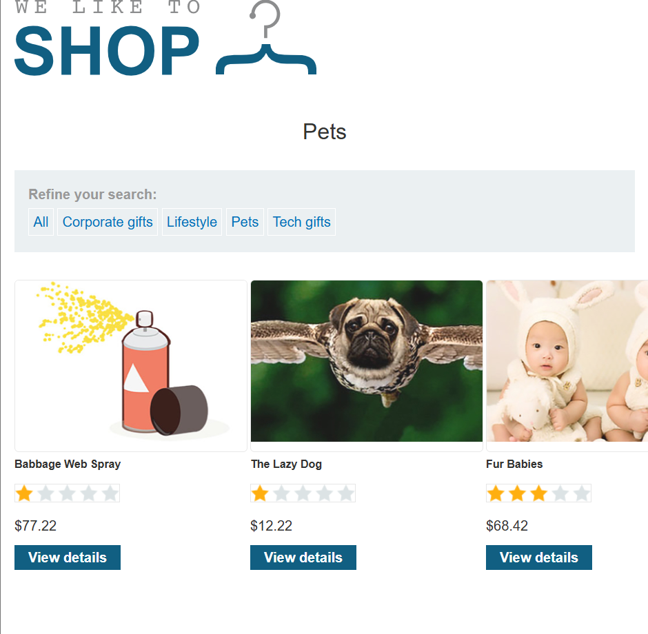
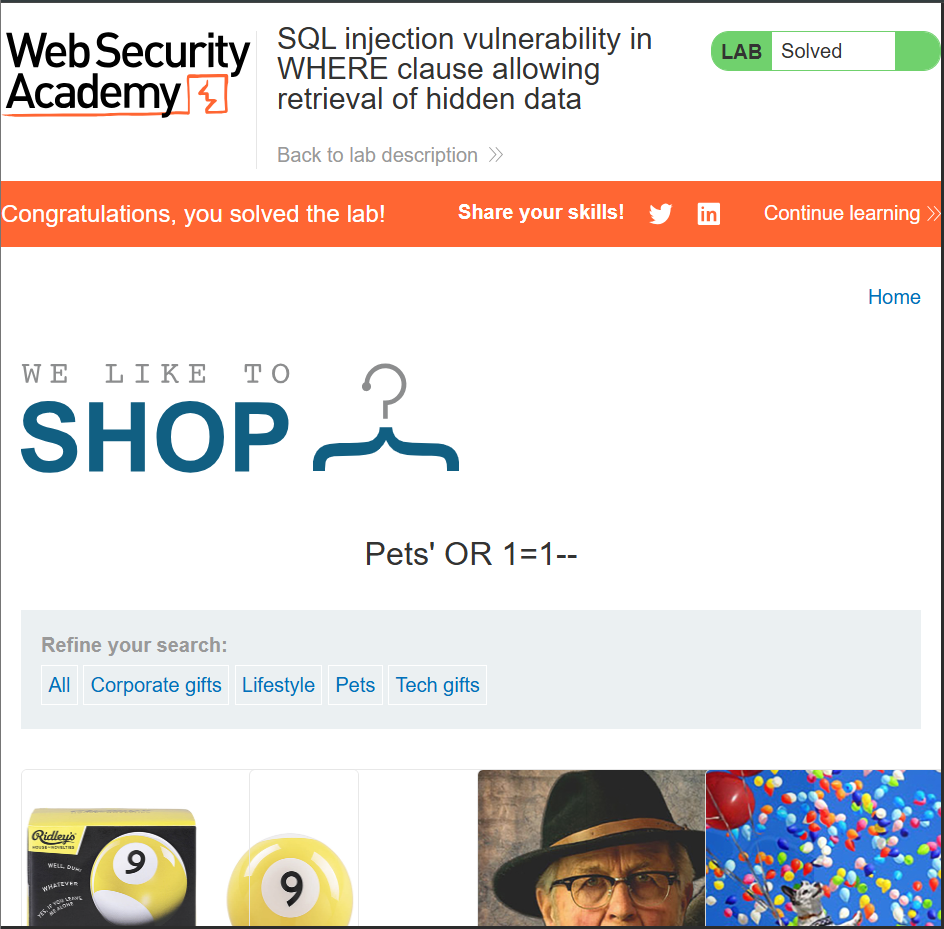

# *SQL injection vulnerability in WHERE clause allowing retrieval of hidden data.*

### Objectives🎯
- Performing an SQL injection attack that causes the application to display one or more unreleased products.
---
### Steps🤺
- Accessed the lab and navigated to the `Pets` category page


- Noted that selecting a category likely triggers query like:
```sql 
SELECT * FROM products WHERE cartegory = 'Pets' AND released = 1
```

- I inspected the URL and injected a simple SQL payload to manipulate the query.
- Injected `'--` at the end of the category parameter to comment out the `AND released = 1` clause.

This successfully revealed an unreleased product under the `Pets` category only (*Pet Experience Days ). 


-  To take it further and view unreleased products across all categories, I injected: `' OR 1=1--` This modified the SQL query to: 

```sql 
SELECT * FROM products WHERE category = 'Pets' OR 1=1-- ' AND released = 1
```

 Which effectively bypasses the entire WHERE condition, causing the database to return **all products**, regardless of category or release status.
 
 