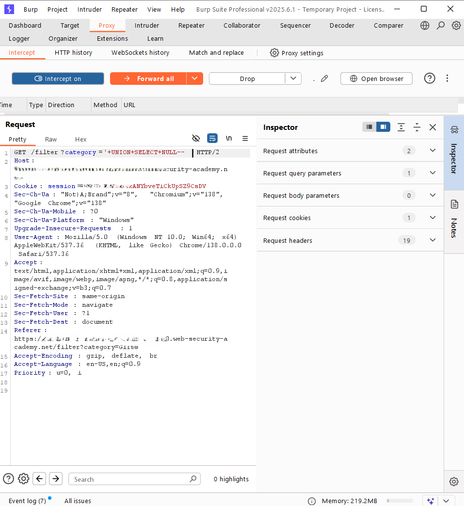
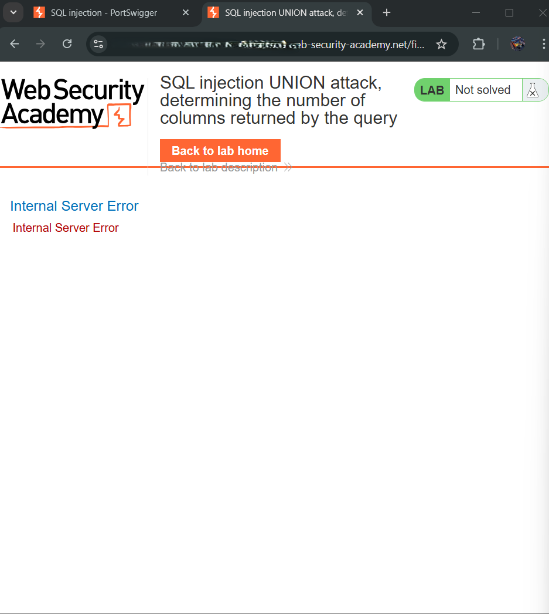
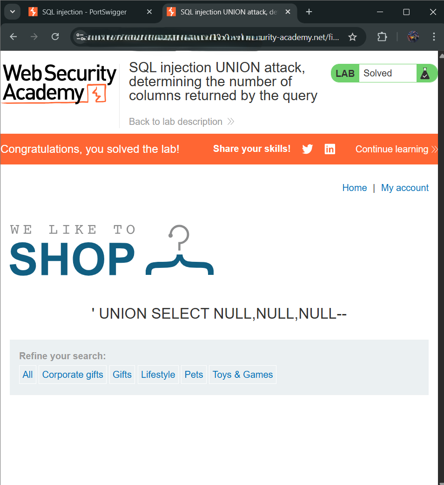

# SQL injection UNION attack, determining the number of columns returned by the query

### Objectives 🎯
- Determine the number of columns returned by the query by performing a SQL injection UNION attack.

### Steps Followed To Solve the lab 🤺
- Navigated to Lifestyle category.
- Used Burp Suite to intercept the request and used a payload `'+UNION+SELECT+NULL--` to modify the category parameter. This caused an error (Internal server error).

---

---
---

- Made another request, intercepted it and used an updated payload `'+UNION+SELECT+NULL,NULL--`, which returned the same error.
- Repeated the process with the payload `'+UNION+SELECT+NULL,NULL,NULL--` which successfully worked, and the **lab was solved**

---
### 🧠 Conclusion
The number of columns returned by the original query is **three**.  
This was confirmed by a successful `UNION SELECT` injection using **three NULL values**.  
Now that the column count is known, future attacks can use this structure to extract meaningful data.

### Tools Used⚙️
1. Burp Suite: Intercepting and modifying the HTTP request.
2. Browser: To view and compare the response after each payload test.